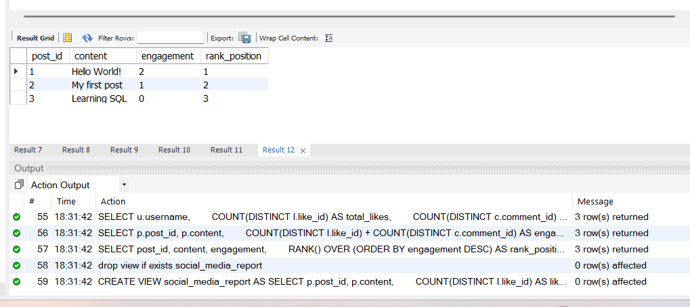

Social Media Analysis using SQL

 Project Overview:

This project analyzes social media data to extract insights such as user activity,
post engagement, and trending content using SQL.

Technologies Used:
* SQL (MySQL)
* Joins
* Aggregate Functions
* Window Functions
  
Key Analysis:
* Most active users
* Most liked posts
* Most commented posts
* User engagement (likes + comments)
* Trending posts based on engagement
  
Features:
* Data analysis using SQL queries
* Ranking posts using window functions
* Engagement calculation (likes + comments)
* Clean and structured queries
  
How to Run:
* Open MySQL
* Run social_media.sql
* Execute analysis queries
  
Output:

